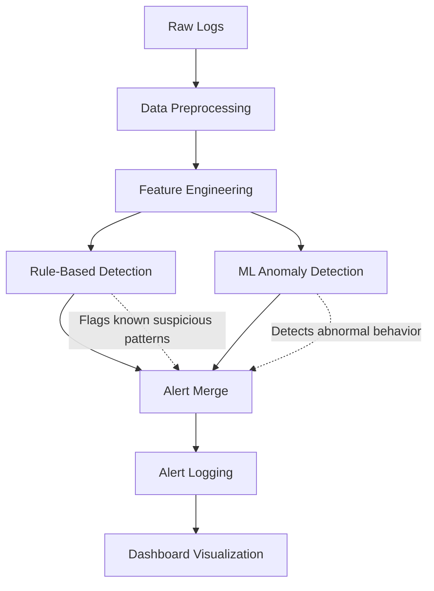

# Project Report

## Intrusion Detection System Using Rule-Based and Machine Learning Detection

**Python Cybersecurity and Machine Learning Project**

| Item | Details |
|---|---|
| Project Name | Intrusion Detection System |
| Technology Stack | Python, Pandas, NumPy, Scikit-learn, Streamlit, Matplotlib, Seaborn |
| Detection Methods | Rule-based detection and Isolation Forest anomaly detection |
| Dataset | Synthetic KDD/CICIDS-style network traffic logs |
| Generated Records | 2,500 network log records |
| Detected Alerts | 451 suspicious or anomalous events |

---

## 1. Introduction

Cybersecurity has become one of the most important areas of modern computing because organizations depend on continuously connected systems, cloud services, web applications, and internal networks. As digital infrastructure grows, the volume of network traffic also increases, creating more opportunities for attackers to hide malicious activity inside normal communication patterns. Intrusion Detection Systems, commonly known as IDS solutions, are designed to monitor this traffic and identify behavior that may indicate scanning, brute-force login attempts, policy violations, malware communication, or unauthorized access.

The broader field of intrusion detection combines network engineering, security operations, data analysis, and machine learning. Traditional IDS tools often rely on signatures or fixed rules, which are effective for known attack patterns but can miss unusual behavior that has not been manually defined. Machine learning methods provide an additional layer by learning normal behavior and identifying deviations from that baseline. A practical IDS benefits from both approaches: rule-based detection provides explainability, while anomaly detection helps identify suspicious behavior that does not match predefined rules.

This project implements a complete Python-based IDS that analyzes log data similar to KDD Cup and CICIDS datasets. The system processes traffic records containing source IP, destination IP, protocol, port, packet count, duration, timestamp, and failed login attempts. It then performs preprocessing, feature engineering, rule-based detection, machine learning anomaly detection, alert generation, and dashboard visualization. The result is a modular and runnable cybersecurity project suitable for demonstrating practical software engineering, security analytics, and machine learning skills.

---

## 2. Problem Statement

Modern networks generate large volumes of traffic, making manual monitoring impractical. Security teams need systems that can automatically identify suspicious patterns such as repeated failed login attempts, excessive connections from a single IP address, access to restricted ports, and unusual packet behavior. Without automation, important signals can be missed, especially when malicious activity is distributed across many records or hidden among normal traffic.

The main problem addressed by this project is the lack of a simple, extensible, and understandable IDS pipeline that combines explainable rules with machine learning. Rule-only systems can be too rigid, while machine-learning-only systems can be difficult to interpret. A production-oriented approach must provide both clear security logic and statistical anomaly detection, along with persistent alerts and a dashboard for analysis.

The impact of this problem is significant. Undetected abnormal traffic can lead to credential compromise, unauthorized service access, data exfiltration, lateral movement, downtime, and financial loss. The users affected include system administrators, security analysts, small organizations, educational institutions, and software teams that need a practical way to understand intrusion detection concepts and prototype security monitoring workflows.

---

## 3. Objectives

The primary objective of this project is to design and implement a modular Python Intrusion Detection System that detects suspicious network activity using both rule-based logic and machine learning anomaly detection.

### Specific Objectives

- To generate or load structured network log data with fields commonly used in IDS datasets.
- To clean, normalize, and encode network traffic data for analysis and model training.
- To engineer security-relevant features such as connection frequency, port usage, session duration statistics, and failed attempt counts.
- To implement transparent rules for restricted ports, excessive requests, and repeated failed logins.
- To train an Isolation Forest model on normal traffic and predict anomalous records.
- To produce categorized alerts and visualize traffic trends through a Streamlit dashboard.

---

## 4. Methodology

The methodology follows a software development and analytical approach. The project was implemented as a modular Python application, with each major responsibility separated into its own module. This structure makes the system easier to test, extend, and explain. The pipeline begins with raw network logs and ends with saved alerts, trained model artifacts, application logs, and an interactive dashboard.

### Tools and Materials

- Python for the complete IDS application and pipeline orchestration.
- Pandas and NumPy for log loading, cleaning, transformation, and feature computation.
- Scikit-learn for `StandardScaler` preprocessing and `IsolationForest` anomaly detection.
- Streamlit for the dashboard interface.
- Matplotlib and Seaborn for traffic and alert visualizations.
- Python `logging` module for operational logs and alert persistence.
- Synthetic KDD/CICIDS-style traffic logs for immediate reproducibility.

### System Flow



Fallback text flow:

```text
Raw Logs -> Data Preprocessing -> Feature Engineering -> Rule-Based Detection + ML Anomaly Detection -> Alert Merge -> Alert Logging -> Dashboard Visualization
```

### Step-by-Step Process

#### 1. Data Loading and Generation

The project loads logs using Pandas. If no dataset is available, it automatically generates a synthetic network traffic dataset similar to KDD Cup or CICIDS-style logs.

The generated dataset includes:

- `timestamp`
- `source_ip`
- `destination_ip`
- `port`
- `protocol`
- `packet_count`
- `duration`
- `failed_attempts`
- `label`

#### 2. Data Preprocessing

The preprocessing module performs the following operations:

- Handles missing values in numeric, categorical, and timestamp fields.
- Converts timestamp values into proper datetime format.
- Encodes IP addresses into numeric form.
- Encodes protocol values using one-hot encoding.
- Clips extreme outliers using percentile limits.
- Normalizes numerical features using `StandardScaler`.

Raw values are preserved for alert readability, while scaled values are used for machine learning.

#### 3. Feature Engineering

The feature engineering module creates behavior-based features that improve detection quality:

- Connection frequency per source IP
- Unique destination count per source IP
- Unique port count per source IP
- Port usage count
- Average session duration by IP
- Total failed attempts by IP
- Packets per second
- Hour and minute of traffic
- Business-hours indicator

These features help convert simple network logs into meaningful behavioral indicators.

#### 4. Rule-Based Detection

The rule-based detector applies transparent security rules:

- Too many requests from the same source IP
- Access to restricted ports
- Repeated failed login attempts

Restricted ports include examples such as `21`, `23`, `25`, `3389`, `4444`, `5900`, and `6667`.

Rule-based detection is useful because it produces clear reasons for each alert, making it easier for analysts to investigate suspicious traffic.

#### 5. Machine Learning Detection

The machine learning module uses `IsolationForest`.

The model:

- Trains on records labeled as normal traffic.
- Learns a baseline of normal network behavior.
- Predicts anomalous records.
- Saves the trained model to the `models/` directory.

Isolation Forest is suitable for anomaly detection because it identifies records that are easier to isolate from normal traffic patterns.

#### 6. Alert Generation

The alert system:

- Merges rule-based alerts and machine learning anomalies.
- Removes duplicate detections.
- Categorizes severity as `LOW`, `MEDIUM`, or `HIGH`.
- Logs alerts to the console.
- Saves alerts to `logs/alerts.log`.
- Saves final alert data to `data/detected_alerts.csv`.

#### 7. Dashboard Visualization

The Streamlit dashboard provides a simple user interface with:

- Live log display
- Detected anomaly table
- Total logs metric
- Detected alerts metric
- High severity alert count
- Unique source IP count
- Traffic over time chart
- Top source IPs chart
- Anomaly count chart

---

## 5. Results and Discussion

The completed IDS project successfully generated and analyzed **2,500 network traffic records**. The pipeline created processed feature data, trained an Isolation Forest model, executed security rules, merged duplicate detections, and saved the final alerts to a CSV file.

During the verified run, the system detected **451 suspicious or anomalous events**.

### Output Artifacts

| Output Artifact | Description |
|---|---|
| `data/network_logs.csv` | Generated synthetic network traffic records |
| `data/processed_features.csv` | Preprocessed and engineered features |
| `data/rule_based_alerts.csv` | Events flagged by security rules |
| `data/ml_anomalies.csv` | Events flagged by Isolation Forest |
| `data/detected_alerts.csv` | Merged alert dataset with severity |
| `models/isolation_forest_model.joblib` | Saved trained anomaly detection model |
| `logs/alerts.log` | Persistent security alert log |
| `logs/ids_app.log` | Application runtime log |

### Alert Severity Distribution

| Severity | Alert Count | Meaning |
|---|---:|---|
| LOW | 242 | Suspicious but lower-confidence or lower-impact activity |
| MEDIUM | 0 | Elevated risk based on traffic volume or behavior |
| HIGH | 209 | High-risk activity such as restricted port access with repeated failed attempts |

### Sample High-Severity Alert

```text
HIGH | machine_learning+rule_based | 203.0.113.21 -> 172.16.0.13:21 | Access to restricted port; Repeated failed login attempts
```

### Discussion

The results show that the IDS can detect both explicit policy violations and statistical anomalies. Rule-based detection is strongest when the suspicious behavior is known in advance, such as access to restricted ports or repeated failed authentication behavior. Machine learning detection is useful for identifying traffic records that differ from the learned normal baseline, including unusual combinations of packet counts, duration, source behavior, and protocol usage.

The dashboard provides a practical analyst view. It displays live logs, detected anomalies, high-level metrics, traffic over time, top source IP addresses, and anomaly counts by severity. This makes the project more realistic than a command-line-only script because security monitoring usually requires both automated detection and visual investigation.

The project met its objectives by producing a complete runnable IDS with no missing modules. It also demonstrates professional engineering practices: reusable functions, separated modules, saved models, persistent logs, a documented architecture, and dashboard visualization.

### Limitations

- The included dataset is synthetic, so real-world deployment would require integration with actual network telemetry.
- Real data sources may include firewall logs, Zeek logs, Suricata alerts, NetFlow records, or cloud security logs.
- Isolation Forest may produce false positives when normal traffic patterns change.
- Production deployment would require periodic retraining, threshold tuning, authentication, and secure storage.

---

## 6. References

- Scikit-learn Developers. *IsolationForest*. Scikit-learn Machine Learning Library Documentation.
- Pandas Development Team. *Pandas Documentation: DataFrame, CSV loading, and data transformation*.
- Streamlit Documentation. *Building interactive data applications in Python*.
- KDD Cup 1999 Dataset. *Network intrusion detection benchmark dataset*.
- Canadian Institute for Cybersecurity. *CICIDS datasets for intrusion detection research*.
- NIST. *Guide to Intrusion Detection and Prevention Systems*.

---

## Thanks and Regards

**Ajayram**
